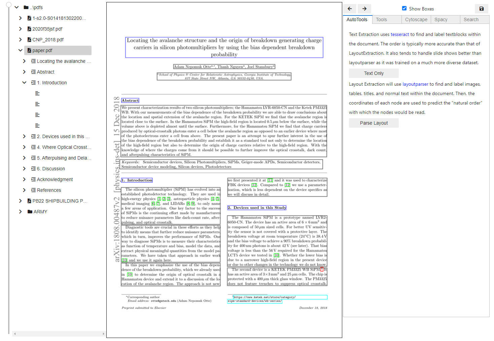
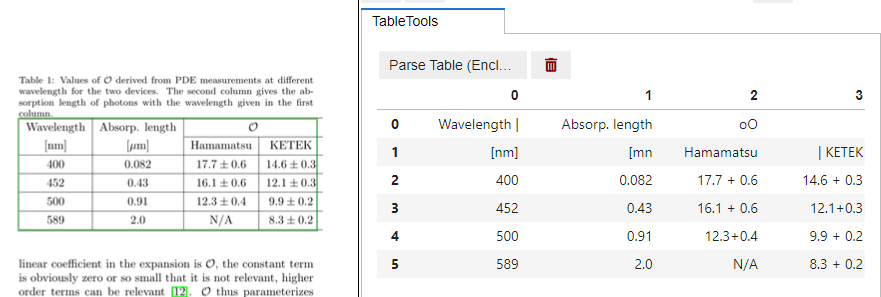
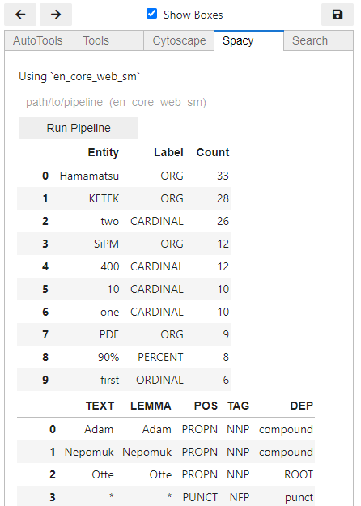

# iPyPDF
A Jupyter-based tool to help parse out structured text from a PDF document and explore the contents.


## Installation
### Windows Installer
https://drive.google.com/drive/folders/1wmQisECMor04dgv9ZXFc07zq6zcHuija?usp=sharing

### From Source
1. Clone this repo
2. Install Anaconda or Miniconda if you do not already have it
3. Install mamba `conda install mamba`
    * Solving the environment is impossibly slow without mamba
4. Create the environment and install ipypdf from source
```bash
mamba env create -f environment.yml -p env/ipypdf
conda activate env/ipypdf
pip install -e .
```
> Note: you can replace "mamba" with "conda" if you don't have mamba installed. It will just take longer to solve the environment.


### From pip
1. Create a conda environment with `Tesseract` and `Jupyterlab`
```bash
conda create -n ipypdf jupyterlab tesseract -c conda-forge`
conda activate ipypdf
pip install ipypdf
```
2. Get a spacy model (the previous method accomplishes this automatically in the `environment.yml` file)
   1. `python -m spacy download en_core_web_sm`
   2. Or `conda install spacy-model-en_core_web_sm -c conda-forge`

### Without Conda
You may run into some issues with Tesseract environment variables. It is still recommended that you use a fresh environment, `virtualenv` for example, to avoid numpy conflicts.
1. Install Tesseract
2. Create and activate a fresh environment (highly recommended)
3. Install ipypdf and jupyterlab
```bash
pip install jupyterlab
pip install ipypdf
python -m spacy download en_core_web_sm
```

## Usage
ipypdf is built for jupyter lab but should also work in jupyter notebooks.

1. Launch jupyter lab with `jupyter lab`
```python
from ipypdf import App
app = App("path/to/your/pdfs", bulk_render=False)
app
```

see `notebooks` for additional info

### Development
see `DEVELOPMENT.md`

### Common Issues
* AutoTools widget keeps saying layoutparser is not installed
    * This is usually a problem with pywin32.
    * Try `conda install pywin32`
    * Also make sure that numpy is <1.19.3


## Features
Within the GUI are 3 panels, Table of Contents, PDF viewer, and Tools.
In this section we are going over all of the various options available in the tools
panel.

### Auto-Tools
This tab contains tools which will iterate through each page of the pdf.
* `Text Only`: Runs each page through [Tesseract](https://github.com/tesseract-ocr/tesseract) to obtain plain text.
* `Parse Layout`: Uses [layoutparser](https://github.com/Layout-Parser/layout-parser)
to label portions of the document as either (title, text, image, or table). The sections
are then assembled together using a few simple rules in order to appoximate a shallow content hierarchy.
  * Title and Text blocks are cropped out and sent through Tesseract to obtain the text.
  * Tables are processed using a rule-based table parsing scheme described [here](https://github.com/JoelStansbury/PubTabNet/blob/main/README.pdf). 
  * Image blocks have no additional processing.



> Notice that section 3 is missing. The process is not perfect. In this case, a section title was mislabled by layoutparser as standard text. Mistakes like this are fairly common. To correct them, you can edit the table of contents using the arrow keys (the cursor must be hovering over the table of contents).

### Table Parsing



### Cytoscape
`Folders`, `PDF Documents`, and `Sections` have a tab labeled `Cytoscape`. This runs a tfidf similarity calculation over all nodes beneath the selected item. I.e. if you select the root node, then all defined nodes will be included in the calculation. However, only those with a link to another node will be drawn (this is for speed, may change this in the future).

The color of each node denotes the pdf document it originated from.


Selecting a node in the graph will highlight the node in the `DocTree`. Clicking the node in the `DocTree` will render the first page of the node.


### Spacy
Extracts named entities from the selected branch of the document tree. I.e.,
the raw text is compiled from a depth first search on whichever node is selected
in the table of contents. Then, `spacy.nlp(text).ents` returns the named entities
found within the section.



### Digitizing Utilities
> I recommend turning off `Show Boxes` as this changes pages every time you add a node (working on a better solution)

Each node has a specific set of tools available to use. Here are the tools provided when a `Section` node is selected.
Starting from the left:
 * `Add Section Node` adds a sub-node of type `Section` and selects it
 * `Add Text Node` adds a sub-node of type `Text` and selects it
 * `Add Image Node` ...
 * `Delete Node` Delete the selected node and all of its children


### Content Selector
Content is extracted from the rendered image. Text is extracted using Optical Character Recognition (OCR). Images don't do any image analysis, they just denote coordinates and page number so that they can be retreived later if need be.

When a `Section` node is selected, the selection tool will attempt to parse text from the portion of the page selected by the user. This text will __overwrite__ the label assigned to the node.

When a `Text` node is selected, the selection tool will attempt to parse text from the selected area and __append__ it to the node's content. This is because text blocks are not always perfectly rectangular, and often span multiple pages.

When an `Image` node is selected, the coordinates of the box are appended to the node's content.

### Save Button
This will generate `json` files for each document. When the tool is initialized, these are used to reconstruct the table of contents. You can also use the json file directly.
